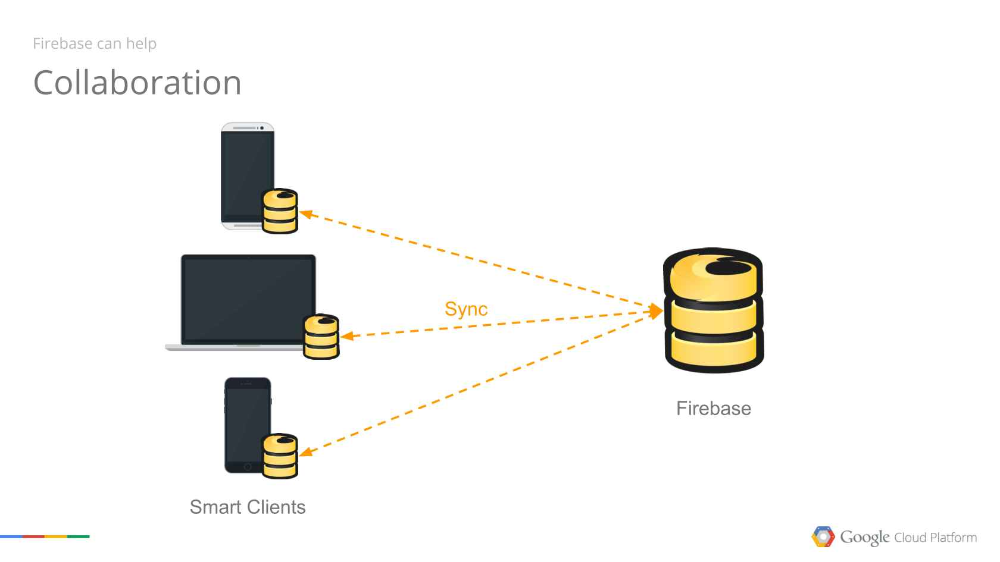

Tags: 

## Basic Overview
This web application is used to manage contacts using a global database to store information worldwide. A basic user can view and add as many contacts he wants, however this information is not verified and nobody can guarantee if the information is correct or not. 

If the users choose to connect their wallet to the app, their account will be verified, and from this point, only they will be able to update the information related to their wallet address. 

If a contact is not verified, all users can update the information.

## Get started
1. Create **.env** file inside root folder with following keys (ask your team lead for the values):
- REACT_APP_FIREBASE_API_KEY
- REACT_APP_FIREBASE_APP_ID
- REACT_APP_FIREBASE_SENDER_ID

2. Run the following commands:
- yarn install
- yarn start
  
**You are ready to go**

Open [http://localhost:3000](http://localhost:3000) to view the app in the browser.  

This project was bootstrapped with
[Create React App](https://github.com/facebook/create-react-app).

Before making you first PR, please read our [Guideline](#guideline).

## Available Scripts

In the project directory, you can run:

### `yarn start`

Runs the app in the development mode.  Open
[http://localhost:3000](http://localhost:3000) to view it in the browser.

The page will reload if you make edits.  You will also see any lint errors
in the console.

### `yarn test`

Launches the test runner in the interactive watch mode.  See the section
about
[running tests](https://facebook.github.io/create-react-app/docs/running-tests)
for more information.

### `yarn format`

Runs prettier  

### `yarn tslint:fix`

Runs linters and --fix flag

### `yarn build`

Builds the app for production to the `build` folder.  It correctly bundles
React in production mode and optimizes the build for the best performance.

The build is minified and the filenames include the hashes.  Your app is
ready to be deployed!

See the section about
[deployment](https://facebook.github.io/create-react-app/docs/deployment) for
more information.

### `yarn eject`

**Note: this is a one-way operation. Once you `eject`, you can’t go back!**

If you aren’t satisfied with the build tool and configuration choices, you can
`eject` at any time. This command will remove the single build dependency from
your project.

Instead, it will copy all the configuration files and the transitive
dependencies (webpack, Babel, ESLint, etc) right into your project so you have
full control over them. All of the commands except `eject` will still work, but
they will point to the copied scripts so you can tweak them. At this point
you’re on your own.

You don’t have to ever use `eject`. The curated feature set is suitable for
small and middle deployments, and you shouldn’t feel obligated to use this
feature. However we understand that this tool wouldn’t be useful if you couldn’t
customize it when you are ready for it.

## Guideline
This project is made
* Using latest features of ECMAScript 2020(ES2020)
  * [Whats new?](https://www.digitalocean.com/community/tutorials/js-es2020)
* Following [Airbnb Javascript Style Guide](https://github.com/airbnb/javascript)

## Infrastructure 

Using firebase database and storage as a service leads to a straight forward architecture. Each client app will sync with the firebase SDK to read and write data.

## CI/CD
- We are using git hooks 
1. pre-commit -> will run the linter 
1. pre-push -> will run the tests 
- We are using github actions to deploy the app to firebase. Check out [yml file](./.github/workflows/firebase-hosting-merge.yml)

## Future improvements
- add pagination to the contact list
- send user notification when something changed in the service(currently, any DB change is reflected in the app without refreshing the page, but no notification is displayed for the user)
- search functionality
- create detailed architecture schemas and documentation